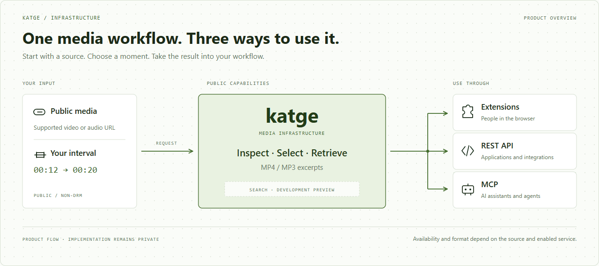

  
  <h1>Katge Infrastructure</h1>
  
<strong>Media infrastructure for people, applications and agents.</strong>

  
Turn a supported media source into the part you need. One product, through browser extensions, REST API and MCP.

  <a href="https://katge.com">Website</a> ·
  <a href="docs/api.md">API</a> ·
  <a href="docs/mcp.md">MCP</a> ·
  <a href="docs/extension.md">Extensions</a> ·
  <a href="docs/architecture.md">How it works</a>

<picture>
  <source media="(prefers-reduced-motion: reduce) and (prefers-color-scheme: dark)" srcset="assets/product-flow-dark.svg" />
  <source media="(prefers-reduced-motion: reduce)" srcset="assets/product-flow.svg" />
  <source media="(prefers-color-scheme: dark)" srcset="assets/product-flow-dark.gif" />
  
</picture>

<a href="assets/product-flow.svg">Static diagram</a> · <a href="assets/product-flow-dark.svg">Dark static diagram</a>

## The part matters

A quote from an interview. A scene from a long video. An audio passage for a
research workflow. Katge gives the requested interval a place in the tools you
already use: the browser, your application, or an AI assistant.

Start with a supported public video or audio source, inspect its metadata,
choose an interval, and retrieve the result. Source access, format and the
enabled service determine what is available. Public, non-DRM media only.

## One product, different interfaces

| Interface | Your workflow |
| --- | --- |
| **Extensions** People | Preview media, choose an interval and save a file. [Browser experience](docs/extension.md) |
| **REST API** Applications | Inspect a source, request a clip, follow its job and retrieve the result. [API workflow](docs/api.md) |
| **MCP** Agents | Give an assistant media tools with explicit inputs and structured results. [Agent workflow](docs/mcp.md) |
| **Website** Everyone | Explore the product, documentation, data flow and release status. [Product website](docs/website.md) |

## A request becomes a result

**Inspect → Select → Retrieve.** The source and the interval are the contract.
Katge returns metadata, progress and a result you can act on. The same product
workflow is available to a person in a browser, an application calling REST,
or an assistant using MCP.

The diagram shows product behavior. It deliberately leaves implementation and
deployment topology out of the picture. [Read the public workflow](docs/architecture.md).

## Find a moment, then choose the clip

Speech, visual and multimodal search are **development previews**. They return
timestamped candidates and explicit coverage information; a client still chooses
the interval to extract. Search is disabled by default and requires an enabled,
accepted deployment. [Explore the search contract](docs/api.md#search-preview).

## Choose your starting point

- **Use the product:** [visit Katge](https://katge.com) and review [extension availability](docs/extension.md).
- **Build an integration:** begin with the [REST request lifecycle](docs/api.md#request-lifecycle).
- **Connect an assistant:** review the [MCP tools and example task](docs/mcp.md#media-tools).
- **Understand the flow:** see [how Katge works](docs/architecture.md) and [what data is shared](docs/privacy.md).

## Availability

| Surface | Current status |
| --- | --- |
| Website | Product website at [katge.com](https://katge.com) |
| REST API and MCP | Integration previews for configured, authorized deployments |
| Backend-connected extension 1.1.0 | Audited candidate; public release and browser acceptance pending |
| Speech, visual and multimodal search | Development preview; disabled by default |

Package builds and public contracts do not establish a working production
gateway or store availability. [Release status and acceptance](docs/releases.md).

## About this repository

**Katge Infrastructure is the public home of the Katge product and integrations.**
It brings the interfaces, examples, product diagrams and release information
together. Implementation source is maintained separately. This repository
contains public documentation and presentation assets; the media engine,
deployment configuration and operational data remain private.

Questions and improvements to these docs are welcome through GitHub issues.
Use the [private security channel](SECURITY.md) for sensitive reports.

[Privacy](docs/privacy.md) · [Changelog](CHANGELOG.md) · [Local publication checks](docs/releases.md#review-this-repository)
