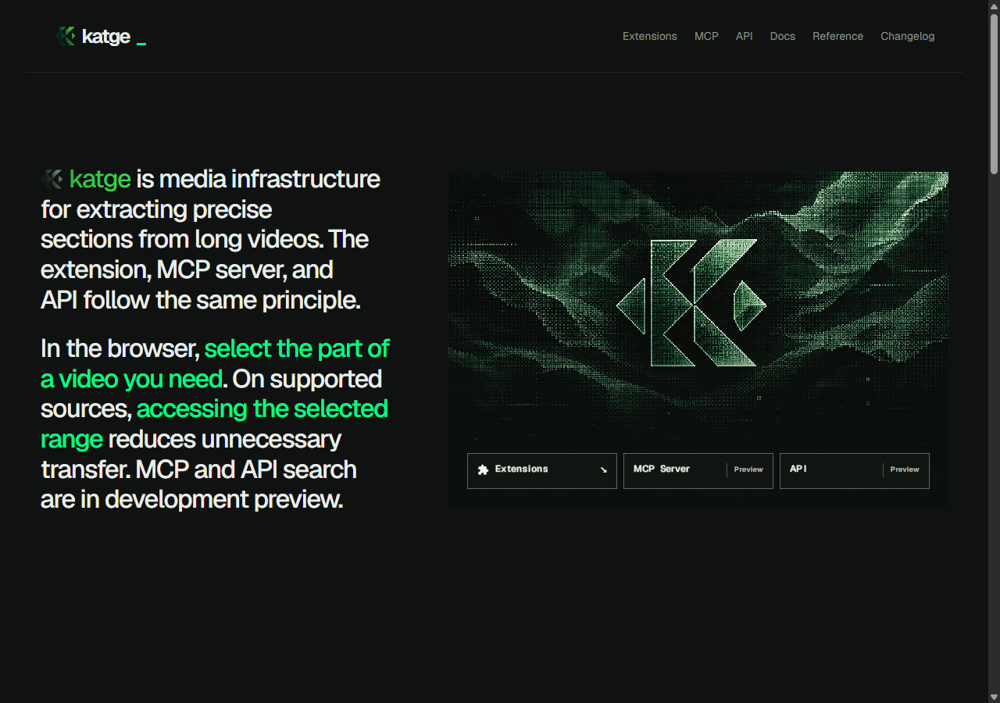

# Katge

Select the part of supported public video or audio you need. Katge's browser
client and REST/MCP interfaces use a backend service to inspect sources and
materialize selected ranges.

[Website](https://katge.com) · [Architecture](docs/architecture.md) ·
[Extension](docs/extension.md) · [API contract](docs/api.md) ·
[Release status](CHANGELOG.md)

The screenshot shows the current development website. It is a product preview,
not evidence of a deployed search service or a published extension package.

## Available and in development

The backend-connected extension 1.1.0 is an unpublished candidate. It requires a
compatible Katge service. Downloads and store availability will be announced
after service, package and browser acceptance; this repository does not provide
an unverified binary.

REST/MCP speech, visual and multimodal search are development previews and remain
disabled by default. Search results are candidates with explicit coverage and
partial status. Turkish visual-query quality and several source paths still
require acceptance.

## About this repository

This is Katge's public presentation and contract documentation. It contains no
backend implementation, private infrastructure, credentials or inherited code
repository history. Browser and service source are reviewed separately.

[Privacy and data flow](docs/privacy.md) · [Security reporting](SECURITY.md)

## Review locally

With Node.js 24 and Git installed, run `node scripts/check-publication.mjs` to
check the approved file inventory, relative links, image headers and isolated
history. No package installation is required.

After committing reviewed changes, `node scripts/export.mjs` creates a ZIP from
that exact commit and records its SHA-256 in the ignored `.data` directory. The
export includes neither the Git database nor local working files.
