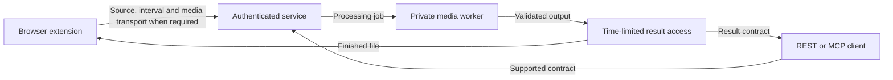

# Public architecture

Katge selects and materializes a requested interval from supported public,
non-DRM media. Source format and access determine which delivery path is available.
No fixed bandwidth-saving percentage or platform-wide compatibility is promised.

## Interfaces and execution

The browser extension provides source selection, preview, time-range inputs and
file saving. It sends source URLs and bounded public-player observations to an
authenticated service. It executes generic transport instructions returned by
that service. Some plans require media to be uploaded for backend processing.
There is no local extraction-engine fallback in the 1.1.0 client.

REST and MCP share application contracts for source inspection, durable jobs,
cancellation and result access. Tenant identity and granted scopes determine
access. A private worker performs media processing; server-side implementation
and signing material are excluded from public packages.

The diagram describes the backend-connected candidate architecture. It does not
certify the current public deployment or any older store version.

## Optional search contracts

Speech search currently matches literal transcript text. Visual search returns
ranked frame candidates. Multimodal AND/OR combines evidence on a common timeline.
Coverage and partial reasons describe what was examined and what remains unknown.
A client chooses extraction intervals; search does not automatically make clips.

Search requires explicit enablement and grants in a prepared deployment. It is
disabled by default and has not been announced as a live public service. Turkish
visual-query quality, natural-video acceptance and long-audio/HLS paths remain
limited. An API schema documents a contract, not production availability.

## Public and private material

Publishable material can describe endpoints, field limits, scope requirements,
job states, data flow and verified limitations. Browser packages contain the
generic client, declared permissions and required legal notices.

Private implementation, environment values, infrastructure configuration,
database details, source maps, signed URLs, credentials and sensitive logs must
not enter public assets, examples, packages or issue reports. Old commits and
archives need review independently of the current source tree.
