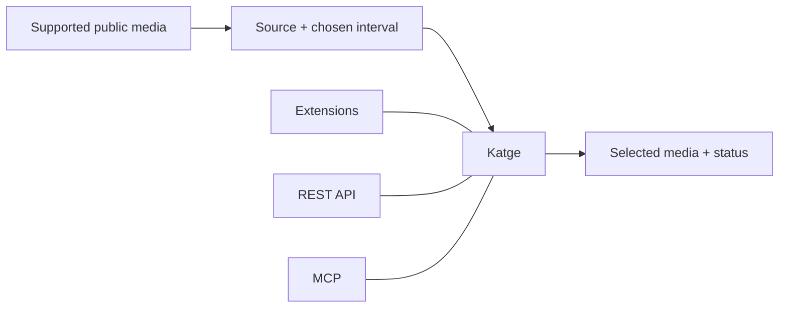

# How Katge works

Katge accepts a supported public media URL and a selected interval, then returns
job status and clip metadata. Browser extensions, REST API and MCP expose this
workflow to people, applications and assistants.

[Overview](../README.md) · [API](api.md) · [MCP](mcp.md) · [Extensions](extension.md)

## The product flow

The Katge box represents the whole product. Internal components and deployment
topology are omitted.

## Inspect

A client supplies a supported public media URL and receives source metadata and
available capabilities. Availability, source format and granted access determine
what can be requested. Public, non-DRM media only.

## Select

The person, application or assistant chooses the interval and output format.
Requests are validated against the source and the caller's permissions and limits.
An accepted asynchronous request returns a job identity and state. Clients can
follow progress and request cancellation through their interface.

## Retrieve

A completed request exposes result metadata and time-limited delivery access.
The browser can save a file, an application can use the result, and an assistant
can return it to the user. Failed or cancelled requests expose a stable state
instead of an invented result.

## Search is an optional starting point

An explicitly enabled search preview can suggest timestamped candidates from
speech, visual or combined evidence. Candidates include coverage and partial
status. The client decides which interval to extract; search does not verify
every event or create clips automatically.

## Public explanation, separate implementation

This repository describes interfaces, accepted inputs, user workflows and result
contracts. It contains no processing source, infrastructure configuration or
operational credentials. Implementation source is maintained separately.

The browser client requires the Katge service. Some requests transfer media for
backend processing; this is not a promise of entirely local execution. Read
[Privacy and data flow](privacy.md) and [Availability](releases.md) before using
or describing an integration.
